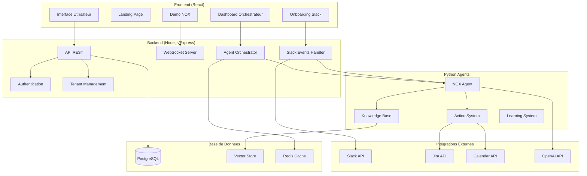
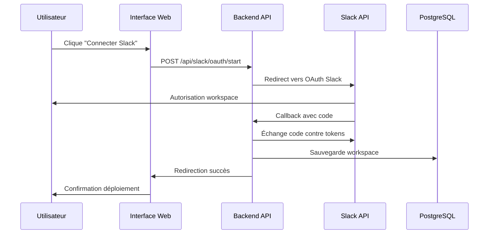
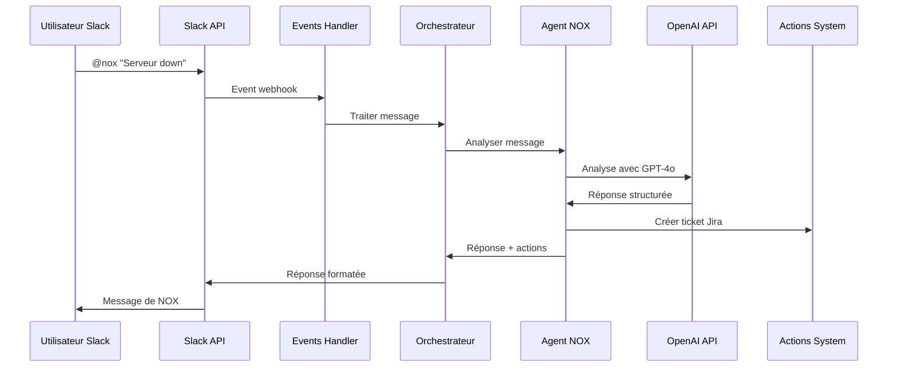
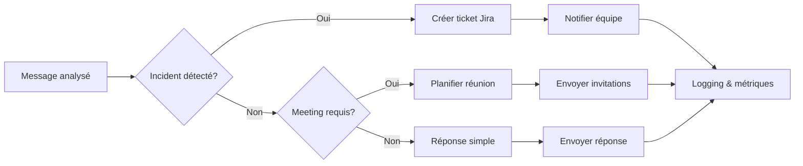

# Architecture Technique Jamono
## Diagrammes d'architecture et implémentation détaillée

---

## 🏗️ Architecture générale du système

### Vue d'ensemble des composants



---

## 🔧 Architecture technique détaillée

### 1. Frontend - React/TypeScript

#### Structure des composants
```
client/src/
├── components/
│   ├── ui/                    # Composants Radix UI
│   ├── layout.tsx             # Layout principal
│   └── agent-card.tsx         # Carte agent
├── pages/
│   ├── NOXHome.tsx           # Page d'accueil NOX
│   ├── nox-demo.tsx          # Démo interactive
│   ├── orchestrator-dashboard.tsx  # Dashboard admin
│   └── onboarding.tsx        # Onboarding Slack
├── hooks/
│   ├── useAuth.ts            # Authentification
│   ├── useWebSocket.ts       # WebSocket
│   └── useAgentChat.ts       # Chat avec agents
└── lib/
    ├── queryClient.ts        # TanStack Query
    ├── websocket.ts          # Client WebSocket
    └── api.ts                # Client API
```

#### Technologies clés
- **React 18** - Composants fonctionnels avec hooks
- **TypeScript** - Typage strict pour la robustesse
- **Tailwind CSS** - Styling utilitaire
- **TanStack Query** - Cache et synchronisation
- **Wouter** - Routing léger
- **Framer Motion** - Animations fluides

### 2. Backend - Node.js/Express

#### Architecture modulaire
```
server/
├── index.ts                  # Point d'entrée
├── routes.ts                 # Routes API principales
├── orchestrator.ts           # Orchestrateur d'agents
├── slack-events.ts           # Gestion événements Slack
├── agent-actions.ts          # Actions automatiques
├── tenant-service.ts         # Gestion multi-tenant
├── auth-routes.ts            # Authentification
├── storage.ts                # Couche de données
├── vector-service.ts         # Recherche vectorielle
└── knowledge-initializer.ts  # Initialisation KB
```

#### Services principaux

##### Agent Orchestrator
```typescript
class AgentOrchestrator {
  // Gestion des workspaces Slack
  async createWorkspace(tokenData: any): Promise<Workspace>
  
  // Déploiement d'agents
  async deployAgentToWorkspace(workspaceId: number, agentId: number): Promise<AgentDeployment>
  
  // Traitement des messages
  async processAgentMessage(deploymentId: number, message: string): Promise<string>
  
  // Métriques et monitoring
  async getAgentMetrics(workspaceId: number): Promise<AgentMetrics>
}
```

##### Slack Events Handler
```typescript
// Gestion des événements temps réel
app.post('/api/slack/events', async (req, res) => {
  const { type, event } = req.body;
  
  if (type === 'event_callback') {
    await handleSlackEvent(event);
  }
});

// Types d'événements supportés
- app_mention     // @nox help
- message         // Messages directs
- team_join       // Nouveau membre
- channel_created // Nouveau canal
```

##### Multi-tenant Service
```typescript
class TenantService {
  // Gestion des tenants
  async createTenant(data: InsertTenant): Promise<Tenant>
  async updateTenantSettings(id: number, settings: any): Promise<void>
  
  // Utilisateurs par tenant
  async inviteUser(tenantId: number, email: string): Promise<TenantUser>
  async activateUser(token: string, password: string): Promise<void>
  
  // Intégrations par tenant
  async addIntegration(tenantId: number, integration: TenantIntegration): Promise<void>
}
```

### 3. Agents Python - IA Spécialisée

#### Architecture des agents
```
agents/
├── models/
│   ├── agent.py              # Classe Agent abstraite
│   └── nox_agent.py          # Agent NOX spécialisé
├── knowledge_base/
│   ├── __init__.py
│   └── devops_knowledge_base.py  # Base DevOps
├── config/
│   └── nox_config.json       # Configuration NOX
└── agent_server.py           # Serveur Python
```

#### Agent NOX - Implémentation
```python
class NOXAgent(Agent):
    """Agent DevOps expert avec capacités d'action automatique"""
    
    def __init__(self):
        super().__init__("NOX", self.load_config())
        self.openai_client = OpenAI(api_key=os.getenv('OPENAI_API_KEY'))
        self.knowledge_base = DevOpsKnowledgeBase()
        
    def process_message(self, message: str, context: dict) -> dict:
        """Traite un message et détermine les actions à prendre"""
        
        # 1. Analyse du message avec GPT-4o
        analysis = await self.analyze_message(message, context)
        
        # 2. Recherche dans la base de connaissances
        relevant_docs = await self.knowledge_base.search(message)
        
        # 3. Génération de la réponse
        response = await self.generate_response(message, analysis, relevant_docs)
        
        # 4. Détection et exécution d'actions
        actions = await self.detect_actions(analysis)
        
        return {
            'response': response,
            'actions': actions,
            'confidence': analysis.confidence
        }
        
    async def detect_actions(self, analysis: dict) -> list:
        """Détecte les actions automatiques à exécuter"""
        actions = []
        
        if analysis.incident_detected:
            actions.append({
                'type': 'create_jira_ticket',
                'priority': analysis.severity,
                'description': analysis.incident_summary
            })
            
        if analysis.needs_meeting:
            actions.append({
                'type': 'schedule_meeting',
                'title': analysis.meeting_title,
                'duration': analysis.estimated_duration
            })
            
        return actions
```

### 4. Base de données - PostgreSQL avec Drizzle ORM

#### Schéma relationnel principal
```sql
-- Tenants et utilisateurs
CREATE TABLE tenants (
    id SERIAL PRIMARY KEY,
    name TEXT NOT NULL,
    domain TEXT UNIQUE,
    plan_type TEXT DEFAULT 'starter',
    status TEXT DEFAULT 'active',
    settings JSONB DEFAULT '{}',
    max_users INTEGER DEFAULT 10,
    max_agents INTEGER DEFAULT 1,
    created_at TIMESTAMP DEFAULT NOW(),
    updated_at TIMESTAMP DEFAULT NOW()
);

-- Workspaces Slack
CREATE TABLE workspaces (
    id SERIAL PRIMARY KEY,
    tenant_id INTEGER REFERENCES tenants(id),
    name TEXT NOT NULL,
    slack_team_id TEXT UNIQUE,
    slack_access_token TEXT,
    slack_bot_user_id TEXT,
    agent_display_name TEXT DEFAULT 'NOX',
    is_active BOOLEAN DEFAULT true,
    created_at TIMESTAMP DEFAULT NOW()
);

-- Déploiements d'agents
CREATE TABLE agent_deployments (
    id SERIAL PRIMARY KEY,
    workspace_id INTEGER REFERENCES workspaces(id),
    agent_id INTEGER REFERENCES agents(id),
    status TEXT NOT NULL,
    configuration JSONB DEFAULT '{}',
    deployed_at TIMESTAMP,
    last_active_at TIMESTAMP
);

-- Interactions avec les agents
CREATE TABLE agent_interactions (
    id SERIAL PRIMARY KEY,
    deployment_id INTEGER REFERENCES agent_deployments(id),
    slack_user_id TEXT,
    slack_channel_id TEXT,
    message_type TEXT NOT NULL,
    user_message TEXT NOT NULL,
    agent_response TEXT,
    response_time INTEGER,
    success BOOLEAN DEFAULT true,
    metadata JSONB DEFAULT '{}',
    created_at TIMESTAMP DEFAULT NOW()
);
```

#### Recherche vectorielle
```sql
-- Extension pour les vecteurs
CREATE EXTENSION IF NOT EXISTS vector;

-- Documents de connaissance avec embeddings
CREATE TABLE knowledge_documents (
    id SERIAL PRIMARY KEY,
    agent_id INTEGER REFERENCES agents(id),
    title TEXT NOT NULL,
    content TEXT NOT NULL,
    document_type TEXT NOT NULL,
    embedding vector(1536),  -- OpenAI embeddings
    tags TEXT[] DEFAULT '{}',
    created_at TIMESTAMP DEFAULT NOW()
);

-- Index pour la recherche vectorielle
CREATE INDEX ON knowledge_documents USING ivfflat (embedding vector_cosine_ops);
```

---

## 🔄 Flux de données et interactions

### 1. Flux d'onboarding Slack



### 2. Flux de traitement d'un message



### 3. Flux d'actions automatiques



---

## 🚀 Performance et scalabilité

### Optimisations actuelles

#### Cache et performance
```typescript
// Cache Redis pour les réponses fréquentes
const cache = new Redis(process.env.REDIS_URL);

// Cache des embeddings
await cache.setex(`embedding:${hash}`, 3600, JSON.stringify(embedding));

// Cache des conversations
await cache.setex(`conversation:${userId}`, 1800, JSON.stringify(history));
```

#### Connection pooling
```typescript
// Pool de connexions PostgreSQL
const pool = new Pool({
  connectionString: process.env.DATABASE_URL,
  max: 20,
  idleTimeoutMillis: 30000,
  connectionTimeoutMillis: 2000,
});
```

#### Optimisations vectorielles
```sql
-- Index optimisé pour la recherche
CREATE INDEX CONCURRENTLY idx_knowledge_embedding 
ON knowledge_documents USING ivfflat (embedding vector_cosine_ops) 
WITH (lists = 100);

-- Requête optimisée
SELECT title, content, 1 - (embedding <=> $1) as similarity
FROM knowledge_documents 
WHERE 1 - (embedding <=> $1) > 0.8
ORDER BY embedding <=> $1
LIMIT 5;
```

### Monitoring et métriques

#### Métriques collectées
```typescript
// Métriques d'agent
await db.insert(agentMetrics).values({
  deploymentId,
  metricType: 'response_time',
  value: responseTime,
  timestamp: new Date(),
  metadata: { model: 'gpt-4o', tokens: usage.total_tokens }
});

// Types de métriques
- response_time     // Temps de réponse
- success_rate      // Taux de succès
- user_satisfaction // Satisfaction utilisateur
- token_usage       // Utilisation tokens OpenAI
- action_count      // Nombre d'actions automatiques
```

---

## 🔒 Sécurité et conformité

### Architecture de sécurité

#### Authentification multi-niveau
```typescript
// JWT avec refresh tokens
const accessToken = jwt.sign(payload, JWT_SECRET, { expiresIn: '15m' });
const refreshToken = jwt.sign(payload, REFRESH_SECRET, { expiresIn: '7d' });

// Validation des permissions
const hasPermission = await checkUserPermission(userId, resource, action);
```

#### Isolation des données
```sql
-- Row Level Security (RLS)
ALTER TABLE agent_interactions ENABLE ROW LEVEL SECURITY;

CREATE POLICY tenant_isolation ON agent_interactions
FOR ALL TO authenticated_users
USING (deployment_id IN (
  SELECT ad.id FROM agent_deployments ad
  JOIN workspaces w ON ad.workspace_id = w.id
  WHERE w.tenant_id = current_setting('app.current_tenant_id')::INTEGER
));
```

#### Chiffrement et secrets
```typescript
// Chiffrement des tokens Slack
const encrypt = (text: string): string => {
  const cipher = crypto.createCipher('aes-256-cbc', ENCRYPTION_KEY);
  let encrypted = cipher.update(text, 'utf8', 'hex');
  encrypted += cipher.final('hex');
  return encrypted;
};

// Gestion des secrets par tenant
await vault.setSecret(`tenant:${tenantId}:slack_token`, encryptedToken);
```

---

## 📊 Monitoring et observabilité

### Logging structuré
```typescript
// Winston logger avec structure
logger.info('Agent response generated', {
  agentId: 'NOX',
  userId: slackUserId,
  responseTime: 1250,
  tokenUsage: 450,
  actionsTriggered: ['jira_ticket'],
  timestamp: new Date().toISOString()
});
```

### Métriques temps réel
```typescript
// Prometheus metrics
const responseTimeHistogram = new prometheus.Histogram({
  name: 'agent_response_time_seconds',
  help: 'Agent response time in seconds',
  labels: ['agent_id', 'workspace_id']
});

// Grafana dashboards
- Agent performance
- User engagement
- System health
- Error rates
```

---

## 🔄 CI/CD et déploiement

### Pipeline de déploiement
```yaml
# .github/workflows/deploy.yml
name: Deploy Jamono
on:
  push:
    branches: [main]

jobs:
  test:
    runs-on: ubuntu-latest
    steps:
      - uses: actions/checkout@v3
      - name: Run tests
        run: npm test
      
  build:
    runs-on: ubuntu-latest
    steps:
      - name: Build application
        run: npm run build
        
  deploy:
    runs-on: ubuntu-latest
    needs: [test, build]
    steps:
      - name: Deploy to production
        run: ./deploy.sh
```

### Infrastructure as Code
```terraform
# Terraform configuration
resource "aws_ecs_service" "jamono" {
  name            = "jamono"
  cluster         = aws_ecs_cluster.main.id
  task_definition = aws_ecs_task_definition.jamono.arn
  desired_count   = 3

  load_balancer {
    target_group_arn = aws_lb_target_group.jamono.arn
    container_name   = "jamono"
    container_port   = 5000
  }
}
```

---

*Documentation technique générée le 8 janvier 2025*
*Équipe Jamono - Architecture Team*